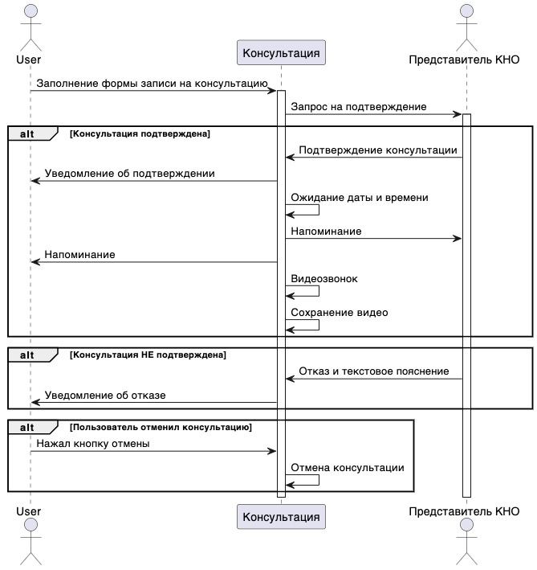

# hack2023
```
https://leaders2023.innoagency.ru
```

## Docs
```
http://hack.torbeno.ru/api/swagger/
```

## Макеты
```
https://www.figma.com/file/gP1lDgHu4iAUoRbKOmPeGF/Открытый-контроль?type=design&node-id=0-1&t=gGS1OOlkDrYQiwhb-0
```

## Мобильное приложение
```
https://github.com/MariyaVik/open-control
```
## Stack APP
- Flutter 2.19.6
- Gradle 7.2.0
- Kotlin 1.7.10

Документация по всем методам API надохится в Swagger формате: http://hack.torbeno.ru/api/swagger/

В API реализована JWT токен OAuth 2.0 модель авторизации, с коротко-живущим ключом access_token и долгоживущим ключом refresh_token

Авторизация через header «Authorization: Bearer some_jwt_token»

Представитель бизнеса: 
login: user
pwd: 123321

Представитель КНО:
login: kno
pwd: 123321

## Stack API
- Golang 1.20
- Echo v4
- MySQL

## Получение ответа в чате


## Запись на консультацию
