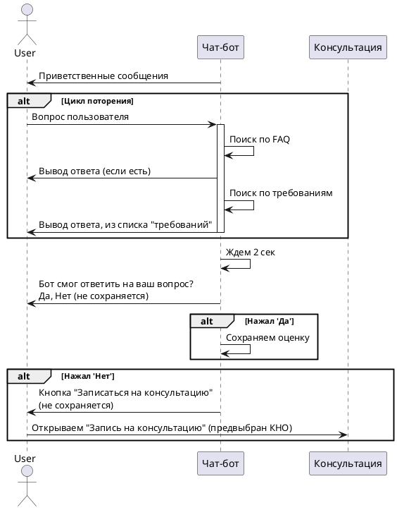
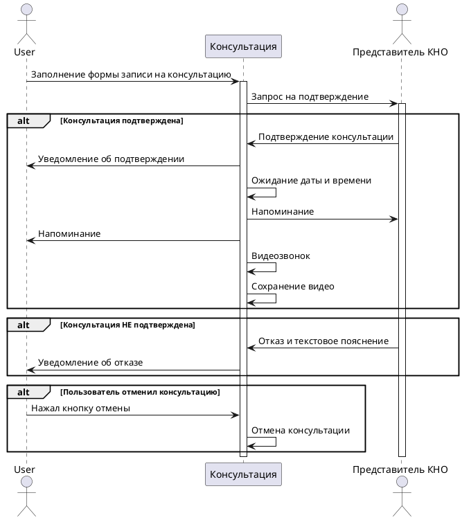

```plantuml
# Получение ответа в чате
@startuml user_story_1
actor User order 10
participant "Чат-бот" as Chatbot order 20
participant "Консультация" as Consultation order 30
Chatbot -> User : Приветственные сообщения
alt Цикл поторения
User -> Chatbot : Вопрос пользователя
activate Chatbot
Chatbot -> Chatbot : Поиск по FAQ
Chatbot -> User : Вывод ответа (если есть)
Chatbot -> Chatbot : Поиск по требованиям
Chatbot -> User : Вывод ответа, из списка "требований"
deactivate Chatbot
end
Chatbot -> Chatbot : Ждем 2 сек
Chatbot -> User : Бот смог ответить на ваш вопрос?\nДа, Нет (не сохраняется)
alt Нажал 'Да'
Chatbot -> Chatbot : Сохраняем оценку 
end
alt Нажал 'Нет'
Chatbot -> User : Кнопка "Записаться на консультацию"\n(не сохраняется)
User -> Consultation : Открываем "Запись на консультацию" (предвыбран КНО)
end
@enduml
```

# Запись на консультацию

```plantuml
@startuml user_story_2
actor User order 10
participant "Консультация" as Consultation order 30
actor "Представитель КНО" as Officer order 40
User -> Consultation : Заполнение формы записи на консультацию
activate Consultation
Consultation -> Officer : Запрос на подтверждение 
activate Officer
alt Консультация подтверждена
Officer -> Consultation : Подтверждение консультации
Consultation -> User : Уведомление об подтверждении
Consultation -> Consultation : Ожидание даты и времени
Consultation -> Officer : Напоминание
Consultation -> User : Напоминание
Consultation -> Consultation : Видеозвонок
Consultation -> Consultation : Сохранение видео
end
alt Консультация НЕ подтверждена
Officer -> Consultation : Отказ и текстовое пояснение
Consultation -> User : Уведомление об отказе
end
alt Пользователь отменил консультацию
User -> Consultation : Нажал кнопку отмены
Consultation -> Consultation : Отмена консультации
end
deactivate Officer
deactivate Consultation
@enduml
```